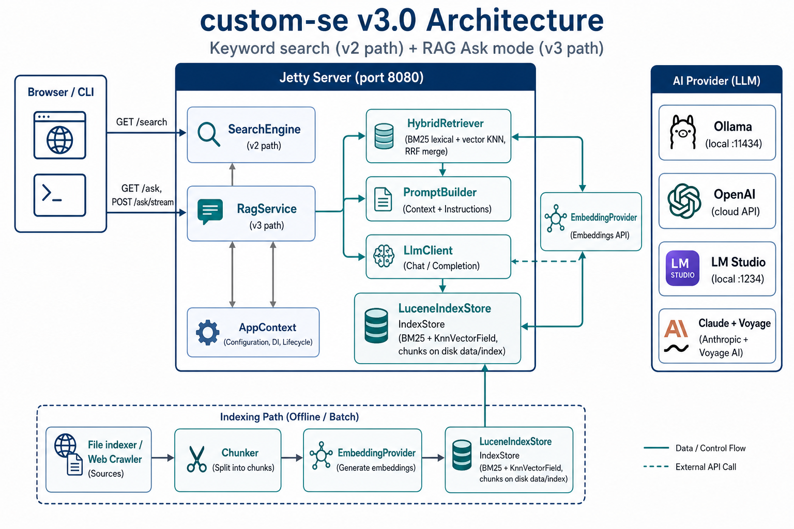

# custom-se

> Multi-threaded **Java 24** search engine with a durable **Apache Lucene** index,
> **BM25** keyword search, and **RAG Ask mode** — hybrid **BM25 + vector** retrieval
> over indexed chunks, then LLM synthesis via **Ollama**, **OpenAI**, **LM Studio**,
> or **Claude + Voyage** — all in a single Maven module with **Jetty** servlets and a
> full HTML UI.

> Built pair-coding with **Claude** (Anthropic) through design, refactors, and tests.

---

## Architecture



See also: [v1 → v3 evolution map](docs/img/evolution-v1-v3.png) ·
[`docs/architecture.md`](docs/architecture.md) · [`docs/protocol.md`](docs/protocol.md) ·
[`docs/runbook.md`](docs/runbook.md) · [`docs/roadmap.md`](docs/roadmap.md)

<details>
<summary>Text diagram (for terminals)</summary>

```
┌──────────────────────────────────────────────────────────────────────────────────┐
│                         CLI (Driver) / Browser (Jetty :8080)                     │
│                                                                                  │
│   GET /search, /api/search                                                       │
│     │                                                                            │
│     ▼                                                                            │
│   ┌──────────────────┐                                                           │
│   │   SearchEngine   │  BM25 exact / partial (v2 path, unchanged)               │
│   └────────┬─────────┘                                                           │
│            │                                                                     │
│   GET /ask, POST /ask/stream, GET /api/ask                                       │
│     │                                                                            │
│     ▼                                                                            │
│   ┌──────────────────┐     ┌─────────────────┐     ┌──────────────────────┐    │
│   │    RagService    │────▶│ HybridRetriever │────▶│  LuceneIndexStore    │    │
│   │  (v3 orchestr.)  │     │ BM25 + KNN + RRF│     │  chunks + vectors    │    │
│   └────────┬─────────┘     └────────┬────────┘     │  data/index (disk)   │    │
│            │                        │ embed query   └──────────▲───────────┘    │
│            │                        ▼                          │                 │
│            │               ┌─────────────────┐                 │ index time     │
│            │               │EmbeddingProvider│                 │                 │
│            │               └────────┬────────┘                 │                 │
│            │                        │                          │                 │
│            ▼                        ▼                          │                 │
│   ┌──────────────────┐     ┌─────────────────────────────────┴────────────┐   │
│   │  PromptBuilder   │     │  File indexer / WebCrawler → Chunker → embed  │   │
│   └────────┬─────────┘     └───────────────────────────────────────────────┘   │
│            │                                                                     │
│            ▼                                                                     │
│   ┌──────────────────┐     stacks (AiProfileResolver + .env)                   │
│   │     LlmClient    │◀─── Ollama │ OpenAI │ LM Studio │ Claude + Voyage       │
│   └────────┬─────────┘                                                           │
│            │ SSE tokens + citations                                              │
│            ▼                                                                     │
│         client                                                                   │
└──────────────────────────────────────────────────────────────────────────────────┘
```

</details>

## Key capabilities

| Area | What it does |
| ---- | ------------ |
| **Keyword search** | `SearchEngine` over `IndexStore`; exact and partial modes with **BM25** ranking via Lucene; unified HTML (`/search`) and JSON (`/api/search`) paths. |
| **RAG Ask** | `RagService` retrieves top chunks with **HybridRetriever** (lexical BM25 + KNN vector, merged by **RRF**), builds a token-budgeted prompt, streams an answer via `LlmClient`, and returns source citations. |
| **Index store** | `LuceneIndexStore` persists word postings, document metadata, and **chunk documents** with `KnnVectorField`; warm-start with `-load-index`; JSON/YAML export for inspection. |
| **Chunking** | `DefaultChunker` splits each `IndexDocument` into ~2 000-char passages with overlap; one Lucene doc per chunk for retrieval and citation. |
| **AI profiles** | `AiProfile` bundles `EmbeddingProvider` + `LlmClient`; `AiProfileResolver` picks stack from session prefs + server defaults; four stacks: **ollama**, **openai**, **lmstudio**, **claude** (Voyage embeddings). |
| **Web server** | Jetty 11 servlet UI (Bulma CSS, dark/light theme); cookie sessions (history, visited, favorites, private mode); in-memory global stats; background crawl jobs; CSRF + rate limits. |
| **CLI** | `Driver` for batch index/search, `-server`, `-ask`, `-ai-stack`, `-reindex-embeddings`; same `SearchEngine` and `RagService` code paths as the server. |
| **Tests** | 90+ unit/integration tests across 31 classes: Lucene store, hybrid retrieval, RAG contracts, provider HTTP parsing, env validation, server smoke (including `/ask` routes). |

### Consistency model

Keyword search is **strongly consistent** with the on-disk Lucene index — every indexed
document is searchable immediately after commit.

RAG retrieval is **index-coupled**:

- Embeddings are stored in Lucene alongside chunk text. The active
  `EmbeddingProvider` at query time **must match** the model recorded in
  `IndexAiMetadata` (provider, model, dimensions).
- On mismatch, hybrid search **degrades to BM25-only** with a user-visible warning
  (`EmbeddingIndexCompatibility`).
- Switching embedding model requires **`/admin/re-embed`** or
  `-reindex-embeddings`; switching chat model alone does not.
- LLM answers reflect retrieved passages at ask time — not live web content.

---

## Tech stack

| Layer | Choice |
| ----- | ------ |
| Language / runtime | **Java 24**, single Maven module (`custom-se` 3.0.0) |
| Search index | **Apache Lucene 9.12** — BM25, `KnnVectorField`, on-disk `FSDirectory` |
| Web server | **Eclipse Jetty 11.0.20** + Jakarta Servlet 5 |
| Stemming / NLP | OpenNLP 2.5.9 |
| HTTP (AI providers) | JDK `HttpClient` via `HttpExchange` with configurable timeouts/retries |
| Embeddings | Ollama, OpenAI, OpenAI-compatible (LM Studio), **Voyage AI** (Claude stack) |
| Chat | Ollama, OpenAI, OpenAI-compatible, **Anthropic Messages API** |
| Config | `application.properties` + **`.env`** (env file wins via `EnvFileLoader`) |
| Build / CI | Maven 3.9, JUnit 5.11, GitHub Actions (JDK 24 Temurin) |

---

## Prerequisites

- **JDK 24** + **Maven 3.9** (compile, test, package)
- **`.env`** file for any AI or server command (copy from `.env.example`)
- One AI stack running locally or with API keys:
  - **Ollama** — `ollama serve` + embedding/chat models pulled
  - **LM Studio** — local server on `:1234/v1`
  - **OpenAI** — `OPENAI_API_KEY`
  - **Claude** — `ANTHROPIC_API_KEY` + `VOYAGE_API_KEY`

---

## Quick start

### Build

```bash
mvn -B package          # compile + test + custom-se-3.0.0.jar
```

### Configure AI

```bash
cp .env.example .env    # set AI_DEFAULT_STACK and keys for your stack
```

### Index local files and start the server

```bash
mvn exec:java -Dexec.mainClass="com.cse.cli.Driver" \
  -Dexec.args="-text input/ -server 8080 -threads 5 -load-index"
```

Open <http://localhost:8080/> for keyword search, <http://localhost:8080/ask> for RAG.

| Surface | URL |
| ------- | --- |
| Search UI | <http://localhost:8080/> — `/search?q=...` |
| Ask UI (SSE) | <http://localhost:8080/ask> |
| JSON search | <http://localhost:8080/api/search?q=...&partial=true> |
| JSON ask | <http://localhost:8080/api/ask?q=...> |
| AI settings | <http://localhost:8080/settings/ai> |
| Health | <http://localhost:8080/api/health> |

### End-to-end smoke test

```bash
# 1) keyword search
curl -s 'http://localhost:8080/api/search?q=example&limit=5' | python3 -m json.tool

# 2) JSON ask (non-streaming)
curl -s 'http://localhost:8080/api/ask?q=What+is+indexed+here%3F' | python3 -m json.tool

# 3) stack connectivity test (from /settings/ai UI or POST /settings/ai/test)
```

### CLI one-shot Ask

```bash
mvn exec:java -Dexec.mainClass="com.cse.cli.Driver" \
  -Dexec.args="-ask \"What topics are covered?\" -ai-stack ollama -index-dir data/index -load-index"
```

### Crawl then serve

```bash
mvn exec:java -Dexec.mainClass="com.cse.cli.Driver" \
  -Dexec.args="-html https://example.com/ -crawl 25 -server 8080 -threads 5"
```

After packaging:

```bash
java -cp target/custom-se-3.0.0.jar com.cse.cli.Driver \
  -text input/ -query queries.txt -partial -results results.json -threads 8
```

---

## Configuration

Settings load from `src/main/resources/application.properties`, then **`.env`**, then
process environment (highest wins).

| Group | Variable / property | Default | Purpose |
| ----- | --------------------- | ------- | ------- |
| **Server** | `SERVER_PORT` / `server.port` | `8080` | Jetty listen port |
| | `SERVER_THREADS` / `server.threads` | `5` | Index/search worker threads |
| | `INDEX_DIR` / `index.directory` | `data/index` | Lucene directory |
| | `admin.password` / `ADMIN_PASSWORD` | `admin` | Shutdown + re-embed gate |
| **Search** | `search.defaultLimit` | `50` | Default result cap |
| | `search.maxLimit` | `500` | Hard max per query |
| **AI stack** | `AI_DEFAULT_STACK` | `ollama` | `ollama` \| `openai` \| `lmstudio` \| `claude` |
| **Ollama** | `OLLAMA_BASE_URL` | `http://localhost:11434` | Local Ollama API |
| **LM Studio** | `AI_LMSTUDIO_BASE_URL` | `http://localhost:1234/v1` | OpenAI-compatible local server |
| **OpenAI** | `OPENAI_API_KEY` | — | Cloud embeddings + chat |
| **Claude** | `ANTHROPIC_API_KEY` | — | Anthropic Messages API |
| | `VOYAGE_API_KEY` | — | Voyage embeddings (default for Claude stack) |
| **RAG** | `ai.rag.topK` | `8` | Chunks retrieved per ask |
| | `ai.rag.maxContextTokens` | `6000` | Prompt budget (trim lowest-score chunks first) |
| | `ai.ask.rateLimitPerMinute` | `30` | Per-session ask rate limit |
| **HTTP** | `ai.http.connectTimeoutMs` | `5000` | Provider connect timeout |
| | `ai.http.readTimeoutMs` | `120000` | Provider read timeout (streaming) |
| | `ai.http.maxRetries` | `2` | Retry count on transient failures |

Model names and dimensions per stack live in `application.properties` under `ai.*`.
Secrets belong only in `.env` — never commit API keys.

### AI stack matrix

| Stack | Embeddings | Chat | Required `.env` |
| ----- | ---------- | ---- | --------------- |
| `ollama` | Ollama (`nomic-embed-text`) | Ollama (`llama3.2`) | `OLLAMA_BASE_URL` |
| `openai` | OpenAI (`text-embedding-3-small`) | OpenAI (`gpt-4o-mini`) | `OPENAI_API_KEY` |
| `lmstudio` | LM Studio (OpenAI-compatible) | LM Studio | `AI_LMSTUDIO_BASE_URL` |
| `claude` | Voyage (`voyage-4`) | Anthropic (`claude-sonnet-4-20250514`) | `ANTHROPIC_API_KEY`, `VOYAGE_API_KEY` |

---

## Command-line flags

Run `com.cse.cli.Driver` (or the packaged JAR main class):

| Flag | Argument | Description |
| ---- | -------- | ----------- |
| `-text` | path | File or directory to index |
| `-query` | path | File of search queries |
| `-partial` | _(none)_ | Partial search instead of exact |
| `-html` | seed URI | Crawl from seed URL |
| `-crawl` | count (default 1) | Max pages when using `-html` |
| `-threads` | count (default 5) | Worker threads |
| `-counts` | path | Write word counts JSON |
| `-index` | path | Write legacy inverted index JSON |
| `-results` | path | Write search results JSON |
| `-server` | port (default 8080) | Start Jetty (requires `.env`) |
| `-index-dir` | path | Lucene directory (default `data/index`) |
| `-load-index` | _(none)_ | Open existing index instead of rebuild |
| `-ask` | question | One-shot RAG ask (requires `.env`) |
| `-ai-stack` | stack id | Override stack for `-ask` / `-reindex-embeddings` |
| `-reindex-embeddings` | _(none)_ | Re-embed all chunks with active stack |

---

## Web API reference

### Search

| Endpoint | Method | Description |
| -------- | ------ | ----------- |
| `/` | GET | Search form (partial/exact, reverse, lucky) |
| `/search?q=...` | GET | HTML results with scores and timing |
| `/api/search?q=...&partial=true\|false&limit=...` | GET | JSON search results |
| `/api/health` | GET | `{"status":"ok"}` |

### AI Ask

| Endpoint | Method | Description |
| -------- | ------ | ----------- |
| `/ask` | GET | Ask form with SSE streaming UI |
| `/ask/stream` | POST | SSE (`retrieval`, `token`, `done`, `error`) |
| `/api/ask?q=...` | GET | JSON answer + sources |
| `/settings/ai` | GET/POST | Stack selection |
| `/settings/ai/test` | POST | Test embedding + chat connectivity |
| `/admin/re-embed` | POST | Re-embed all chunks (password) |

### Sessions, metadata, index

| Endpoint | Method | Description |
| -------- | ------ | ----------- |
| `/history`, `/visited`, `/favorites` | GET | Per-session tracking |
| `/stats/queries`, `/stats/visited` | GET | Top-5 global stats (in-memory) |
| `/index`, `/locations` | GET | Browse indexed words / locations |
| `/download?file=index&type=json\|yaml` | GET | Export index |
| `/crawl` | GET/POST | Background crawl + `/crawl/status` |
| `/admin/shutdown` | POST | Graceful stop (password) |

Private mode disables tracking and clears stored session data. CSRF tokens protect
POST forms; search and ask endpoints are rate-limited separately.

---

## Running the tests

```bash
mvn -B test           # 90+ tests across 31 classes
mvn -B package        # compile + test + JAR
```

| Area | Test classes | What it covers |
| ---- | ------------ | -------------- |
| Lucene index | `LuceneIndexStoreTest`, `SearchParityTest`, `LuceneSchemaTest` | CRUD, BM25 search, chunk + vector fields |
| RAG | `HybridRetrieverTest`, `RagServiceTest`, `RagServiceContractTest`, `PromptBuilderTest` | RRF merge, token budget trim, orchestration |
| AI providers | `Ollama*Test`, `OpenAi*Test`, `AnthropicLlmClientTest`, `VoyageEmbeddingProviderTest` | HTTP request/response parsing |
| Config | `EnvFileLoaderTest`, `AiConfigValidatorTest`, `AiSettingsTest` | `.env` loading and startup validation |
| Server | `ServerSmokeTest`, `UserSessionDataTest`, `MetadataStoreTest` | Servlet wiring, sessions, `/ask` routes |
| Core | `SearchEngineTest`, `InvertedIndexTest`, `SearchEngineIntegrationTest` | Engine parity, CLI integration |

Focused runs:

```bash
mvn -Dtest=ServerSmokeTest test
mvn -Dtest=HybridRetrieverTest test
mvn -Dtest=SearchEngineIntegrationTest test
```

---

## Operations

### Re-embed after model change

```bash
# CLI
mvn exec:java -Dexec.mainClass="com.cse.cli.Driver" \
  -Dexec.args="-reindex-embeddings -ai-stack ollama -index-dir data/index -load-index"

# Or POST /admin/re-embed from the admin panel (password required)
```

### Inspect the Lucene index

Browse `/index` and `/locations` in the UI, or download JSON/YAML via
`/download?file=index&type=json`.

### Tail server startup validation

If `.env` is missing or keys are incomplete, `-server`, `-ask`, and
`-reindex-embeddings` fail fast with `AiConfigValidator` messages before Jetty binds.

### Background crawl

POST to `/crawl` with `seed` and optional `max`. Already-indexed URLs are skipped and
do not count toward the limit. Status at `/crawl/status`.

---

## Project structure

```
custom-se/
├── pom.xml                          Maven parent (Java 24, Lucene, Jetty, JUnit 5)
├── .env.example                     12-factor AI secrets template
├── docs/
│   ├── img/
│   │   ├── architecture.png         Current v3 architecture diagram
│   │   └── evolution-v1-v3.png      v1 → v2 → v3 evolution map
│   ├── architecture.md              Unified design + ADRs (v1–v3)
│   ├── protocol.md                  HTTP, SSE, provider wire formats
│   ├── roadmap.md                   Release history and backlog
│   └── runbook.md                   Operations and troubleshooting
│
├── src/main/java/com/cse/
│   ├── cli/                         Driver, ArgumentParser
│   ├── index/                       IndexStore API, LuceneIndexStore, chunk metadata
│   │   └── lucene/                  Schema, hybrid search, on-disk persistence
│   ├── search/                      SearchEngine, threaded query processing
│   ├── ai/
│   │   ├── profile/                 AiProfile, AiSettings, AiProfileResolver
│   │   ├── embed/                   EmbeddingProvider implementations + EmbeddingIndexJob
│   │   ├── llm/                     LlmClient implementations (Ollama, OpenAI, Anthropic)
│   │   ├── rag/                     RagService, HybridRetriever, PromptBuilder, RrfMerger
│   │   ├── chunk/                   Chunk, DefaultChunker
│   │   ├── config/                  EnvFileLoader, AiConfigValidator
│   │   └── http/                    HttpExchange, AiHttpConfig
│   ├── crawl/                       WebCrawler, background job hooks
│   ├── server/                      JettyServer, AppContext, servlets, sessions, views
│   └── ...                          stem, io, concurrent, net
│
├── src/main/resources/
│   ├── application.properties       Server + AI defaults (no secrets)
│   └── web/logo.svg
│
└── src/test/java/com/cse/           Unit + integration tests (31 classes)
```

---

## Continuous integration

GitHub Actions in [`.github/workflows/maven.yml`](.github/workflows/maven.yml):

- **Compile** — JDK 24 (Temurin), Maven cache
- **Test** — `mvn -B test` (full suite)
- **Package** — `mvn -B package -DskipTests`

Runs on every push and pull request to `main` / `master`.

---

## Extending

- **Add a new AI stack** — implement `EmbeddingProvider` + `LlmClient`, register in
  `AiProfileFactory`, add env keys to `.env.example`, extend `AiConfigValidator`.
- **Tune retrieval** — adjust `ai.rag.topK`, RRF weights in `HybridRetriever`, or
  chunk sizes in `ChunkingOptions`.
- **New servlet routes** — wire in `JettyServer`, share state via `AppContext`; follow
  existing CSRF and rate-limit patterns in `BaseServlet`.
- **Stronger embedding freshness** — after re-embed, bump a cache namespace or block
  asks until `EmbeddingIndexJob` completes (hook exists at `/admin/re-embed`).

Detailed design notes: [`docs/architecture.md`](docs/architecture.md) (evolution,
ADRs, trade-offs). Operations: [`docs/runbook.md`](docs/runbook.md). Wire formats:
[`docs/protocol.md`](docs/protocol.md).

---

## Releases

| Version | Highlights |
| ------- | ---------- |
| [v3.0.0](https://github.com/LKPJohn2026/custom-se/releases/tag/v3.0.0) | AI Ask mode, RAG hardening, HTTP timeouts/retries, expanded tests |
| [v2.4.1](https://github.com/LKPJohn2026/custom-se/releases/tag/v2.4.1) | Claude + Voyage stack, `.env` validation |
| [v2.4.0](https://github.com/LKPJohn2026/custom-se/releases/tag/v2.4.0) | `/ask` UI, SSE streaming, CLI ask flags |
| [v2.3.0](https://github.com/LKPJohn2026/custom-se/releases/tag/v2.3.0) | LLM clients, RagService, AI settings |
| [v2.0.0](https://github.com/LKPJohn2026/custom-se/releases/tag/v2.0.0) | Lucene IndexStore, BM25, async crawl, security hardening |
| [v1.0.0](https://github.com/LKPJohn2026/custom-se/releases/tag/v1.0.0) | Initial Jetty web server |

---

## License

Unlicense (public domain). See [LICENSE](LICENSE).
