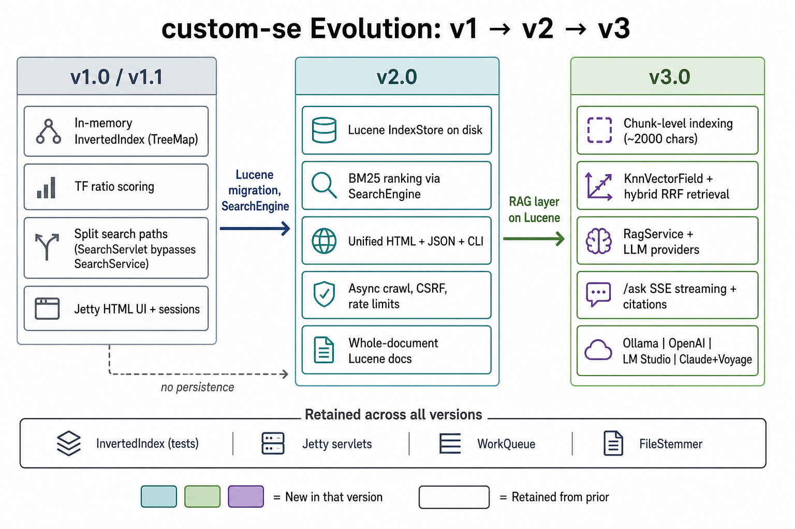

# custom-se Architecture

Authoritative reference for **custom-se** from **v1.0** through **v3.0** (current).
Covers evolution, shipped design, package layout, and **architecture decision records**
with alternatives and trade-offs.

Related docs:

- [`protocol.md`](protocol.md) — HTTP, SSE, and AI provider wire formats
- [`roadmap.md`](roadmap.md) — release history and planned work
- [`runbook.md`](runbook.md) — day-two operations

---

## 1. Evolution: v1 → v2 → v3



<details>
<summary>Text timeline (for terminals)</summary>

```
v1.0–v1.5                          v2.0–v2.4.1                         v3.0 (current)
─────────────────────────────────  ───────────────────────────────────  ─────────────────────────────
InvertedIndex (TreeMap, RAM)   →   LuceneIndexStore (disk)         →   Lucene chunks + KnnVectorField
TF ratio scoring               →   BM25 (Lucene default)           →   BM25 + vector RRF hybrid
SearchServlet bypasses         →   SearchEngine (unified path)     →   SearchEngine unchanged
  SearchService                      HTML + JSON + CLI parity            + RagService for /ask
Whole docs in memory           →   Whole docs in Lucene            →   ~2000-char chunks + embed
No persistence                 →   -load-index warm start          →   IndexAiMetadata coupling
Jetty UI + sessions            →   + async crawl, CSRF, limits     →   + Ask SSE, AI stacks, .env
CLI batch search               →   export JSON/YAML                →   -ask, -reindex-embeddings

Retained all versions: InvertedIndex (tests), WorkQueue, FileStemmer, Jetty servlet routes
```

</details>

### 1.1 v1 baseline (v1.0–v1.5)

| Aspect | v1 design |
| ------ | --------- |
| Index | `InvertedIndex` — `TreeMap<String, Map<String, Integer>>` in memory |
| Concurrency | `ThreadSafeInvertedIndex` wrapping `MultiReaderLock` |
| Scoring | `matches / docLength` (term frequency ratio) |
| Search modes | Exact (AND of stems) and partial (prefix on stems) |
| Server | Jetty servlets, cookie sessions, metadata, crawl UI |
| Persistence | None — rebuild from `-text` / `-html` on every start |
| API parity gap | `SearchServlet` called index directly; HTML used `SearchService` |

**Pain points that drove v2:** no durable index, weak ranking, divergent search
code paths, unbounded index browser pages, `WebCrawler` imported `server.meta`.

### 1.2 v2 changes (v2.0–v2.4.1)

| Change | What shipped |
| ------ | ------------ |
| **IndexStore abstraction** | Application code depends on `IndexStore`, not Lucene types |
| **Lucene 9.12** | On-disk `FSDirectory` at `data/index`; BM25 default similarity |
| **SearchEngine** | Single orchestrator for stats, session, metadata, timing |
| **IndexDocument** | One Lucene doc per file/URL (whole document) |
| **Warm start** | `-load-index`, `-index-dir`, commit on shutdown |
| **Pagination** | Index/location browsers paginated (default 100, max 500) |
| **Async crawl** | `CrawlJobManager`, `/crawl/status`, skip already-indexed URLs |
| **Hardening** | `application.properties` + env, CSRF on POST, rate limits |
| **PageListener** | Decoupled crawler from `MetadataStore` |

**v2.4.1 addition:** `.env` loading groundwork for v3 (not AI features yet in v2.0 core).

### 1.3 v3 changes (v2.1.0–v3.0.0 milestones → v3.0.0 final)

| Milestone | What shipped |
| --------- | ------------ |
| **v2.1.0** | `Chunk`, `Chunker`, chunk Lucene schema, `IndexAiMetadata` |
| **v2.2.0** | `EmbeddingProvider`, `KnnVectorField`, `HybridRetriever`, RRF merge |
| **v2.3.0** | `LlmClient`, `AiProfile`, `RagService`, `PromptBuilder`, `/settings/ai` |
| **v2.4.0** | `/ask`, `/ask/stream`, `/api/ask`, CLI `-ask`, re-embed job |
| **v2.4.1** | Voyage embeddings for Claude stack; `.env` validation |
| **v3.0.0** | HTTP timeouts/retries, token budget trimming, expanded tests |

| Aspect | v3 design |
| ------ | --------- |
| Retrieval unit | **Chunk** (~2000 chars, 200 overlap) — one Lucene doc per chunk |
| Hybrid search | BM25 on chunk text + KNN on `KnnVectorField`, merged by **RRF** |
| Ask path | `RagService` → retrieve → `PromptBuilder` → `LlmClient` stream |
| AI stacks | `ollama`, `openai`, `lmstudio`, `claude` (Voyage embed + Anthropic chat) |
| Keyword search | **Unchanged** — `SearchEngine` / `/search` stay on v2 path |
| Secrets | `.env` + env vars; validated at startup for AI commands |

**Migration rule:** v2 whole-doc Lucene indexes are **not** auto-upgraded. Re-index
from source (`-text` / `-html`) or run a full rebuild to get chunk + vector schema.

---

## 2. Current architecture (v3.0)


<details>
<summary>Text diagram (for terminals)</summary>

```
┌──────────────────────────────────────────────────────────────────────────────────┐
│                         CLI (Driver) / Browser (Jetty :8080)                     │
│                                                                                  │
│   GET /search, /api/search  ──► SearchEngine ──► IndexStore.search()            │
│                                                                                  │
│   GET /ask, POST /ask/stream, GET /api/ask                                      │
│     ──► RagService ──► HybridRetriever ──► IndexStore (chunks + vectors)        │
│              │                    │ embed query                                    │
│              │                    ▼                                                │
│              │            EmbeddingProvider                                      │
│              ▼                                                                   │
│         PromptBuilder ──► LlmClient (Ollama | OpenAI | LM Studio | Claude)      │
│                                                                                  │
│   Index time: FileIndexer / WebCrawler ──► Chunker ──► embed ──► Lucene commit  │
└──────────────────────────────────────────────────────────────────────────────────┘

InvertedIndex / ThreadSafeInvertedIndex  →  unit tests & teaching only
```

</details>

### 2.1 Design principles

1. **Interface at the boundary** — `IndexStore`, `EmbeddingProvider`, `LlmClient`; Lucene confined to `com.cse.index.lucene`.
2. **Two orchestrators** — `SearchEngine` for keyword search; `RagService` for Ask. Not merged.
3. **RAG extends Lucene** — no external vector DB in v3.0.
4. **Index-coupled embeddings** — query-time embedder must match `IndexAiMetadata`; chat model is not coupled.
5. **Protocol behind interfaces** — servlets never call provider URLs directly.
6. **Secrets via env** — API keys in `.env`, never in committed properties.
7. **Fail soft in UI** — friendly errors, no stack traces to users.
8. **InvertedIndex retained** — regression anchor for algorithm teaching and parity tests.

### 2.2 Package layout (shipped)

```
src/main/java/com/cse/
  cli/                    Driver, ArgumentParser
  index/
    IndexStore.java       Core index API (search, chunks, vectors, export)
    IndexDocument.java    Parent document DTO
    IndexAiMetadata.java  Embedding model/dims recorded in meta.json
    SearchHit.java        Keyword result (location, score, snippet)
    SearchQuery.java      raw + QueryMode (EXACT, PARTIAL, PHRASE)
    lucene/               LuceneIndexStore, LuceneSchema — only Lucene imports here
  search/
    SearchEngine.java     Keyword orchestration (stats, session, metadata)
  ai/
    profile/              AiProfile, AiSettings, AiProfileResolver, AiProfileFactory
    embed/                EmbeddingProvider + Ollama, OpenAI, Voyage, OpenAI-compat
    llm/                  LlmClient + Ollama, OpenAI, Anthropic, OpenAI-compat
    chunk/                Chunk, DefaultChunker, ChunkingOptions
    rag/                  RagService, HybridRetriever, PromptBuilder, RrfMerger
    config/               EnvFileLoader, AiConfigValidator
    http/                 HttpExchange, AiHttpConfig
  crawl/                  WebCrawler, PageListener
  server/                 JettyServer, AppContext, servlets, sessions, views
```

---

## 3. Core abstractions

### 3.1 Index layer (v2 foundation, v3 extended)

**`IndexDocument`** — one logical document (file path or crawled URL):

```java
public record IndexDocument(
    String id, String location, String title, String body, long indexedAt) {}
```

**`IndexStore`** — application index contract:

| Operation | Purpose |
| --------- | ------- |
| `open` / `commit` / `close` | Lifecycle |
| `addDocument` | Index parent doc (triggers chunking in v3 pipeline) |
| `search` | BM25 keyword search → `SearchHit` |
| `searchChunks` | BM25 on chunk docs → `ScoredChunk` |
| `searchChunksByVector` | KNN on vector field |
| `listTerms` / `listLocations` | Browse APIs |
| `exportJson` / `exportYaml` | CLI/server export |

**`SearchEngine`** — keyword orchestration: records stats/session/metadata, delegates
to `IndexStore.search`, applies reverse/lucky options.

### 3.2 AI layer (v3)

**`Chunk`** — retrieval and citation unit:

```java
public record Chunk(
    String chunkId, String parentId, String location, String title,
    String text, int sequence, int charOffset) {}
```

**`EmbeddingProvider`** — index time (batch embed chunks) + query time (embed question).
Voyage uses `input_type`: `document` for indexing, `query` for retrieval.

**`LlmClient`** — query time only; `streamChat()` for SSE, `completeChat()` for JSON API.

**`AiProfile`** — bundles embedder + chat client for a stack (`ollama`, `openai`, `lmstudio`, `claude`).

**`HybridRetriever`** — lexical list + optional vector list → `RrfMerger.merge()`.
Falls back to BM25-only when `EmbeddingIndexCompatibility.vectorsEnabled()` is false.

**`RagService`** — `ask()` / `prepareStream()` → retrieve → prompt → generate.

### 3.3 Lucene schema (v3)

| Field | Type | Purpose |
| ----- | ---- | ------- |
| `chunkId` | `StringField` | Unique chunk id |
| `parentId` | `StringField` | Parent document id |
| `location` | `StringField` | Citation URL |
| `title` | `TextField` | Boosted in queries |
| `text` | `TextField` | Chunk body (BM25 + stored for LLM) |
| `sequence` | `IntPoint` | Order within parent |
| `indexedAt` | `LongPoint` | Timestamp |
| `vector` | `KnnVectorField` | Embedding float[] |

**Index directory:**

```
data/index/
  lucene/       # Lucene segments
  meta.json     # IndexAiMetadata (provider, model, dimensions, chunking)
```

**Analyzer:** `EnglishAnalyzer`; parity with v1 stemming validated by `SearchParityTest`.

---

## 4. Architecture decision records

Each decision lists **options considered**, **choice made**, and **trade-offs**.

### ADR-1: Index backend (v2)

| Option | Pros | Cons |
| ------ | ---- | ---- |
| **Keep in-memory `InvertedIndex`** | Simple, fast for tiny corpora, zero deps | No persistence, RAM-bound, poor scaling |
| **Embedded Apache Lucene** ✓ | Mature BM25, disk persistence, KNN in v3, single JVM | Operational tuning needed; not distributed |
| **Elasticsearch / OpenSearch** | Horizontal scale, rich ops tooling | Heavy ops, network hop, overkill for single-node teaching project |
| **SQLite FTS5** | Lightweight, SQL familiarity | Weaker ranking ecosystem; no native KNN in v3 timeframe |

**Decision:** Embedded Lucene 9.12 via `LuceneIndexStore`.

**Rationale:** Matches project scope (single-node, teaching + demo). v3 vector search
reuses the same index without a second datastore. `InvertedIndex` kept for tests.

---

### ADR-2: Ranking function (v2)

| Option | Pros | Cons |
| ------ | ---- | ---- |
| **TF ratio (`matches/docLength`)** | Simple, matched v1 behavior | Poor relevance vs modern IR; no IDF |
| **BM25 (Lucene default)** ✓ | Industry standard, built into Lucene | Scores not comparable to v1 (locations parity tested, not scores) |
| **Custom TF-IDF** | Full control | Reinventing Lucene; maintenance burden |

**Decision:** BM25 via Lucene default similarity.

**Rationale:** Better result quality with zero custom scoring code. `SearchParityTest`
validates **location sets** on the test corpus, not score equality.

---

### ADR-3: Search orchestration (v2)

| Option | Pros | Cons |
| ------ | ---- | ---- |
| **Per-servlet index calls (v1)** | Minimal indirection | HTML/JSON divergence; duplicated stats/session logic |
| **Unified `SearchEngine`** ✓ | One path for CLI, HTML, JSON | Thin wrapper still needed for HTTP param parsing |
| **Merge search into servlets** | Fewer classes | Untestable side effects; servlet bloat |

**Decision:** `SearchEngine` owns orchestration; `SearchService` / servlets are thin adapters.

**Rationale:** Fixed v1 API parity gap (`SearchServlet` now uses same path as HTML).

---

### ADR-4: Document vs chunk indexing (v3)

| Option | Pros | Cons |
| ------ | ---- | ---- |
| **Whole document (v2)** | Simple schema, fast indexing | Too large for LLM context; imprecise citations |
| **Fixed-size chunks with overlap** ✓ | Fits context windows; precise citations | More Lucene docs; re-index on chunk param change |
| **Semantic / sentence boundaries** | Cleaner splits | Slower; needs NLP pipeline; harder to test |

**Decision:** ~2000-char chunks, 200-char overlap, cap per document (`ChunkingOptions`).

**Rationale:** Predictable behavior, easy to test, good enough RAG precision for v3.0.

---

### ADR-5: Vector storage (v3)

| Option | Pros | Cons |
| ------ | ---- | ---- |
| **Lucene `KnnVectorField` (same index)** ✓ | No second system; transactional with text | ANN tuning limited vs dedicated DBs |
| **Pinecone / Qdrant / Weaviate** | Best-in-class ANN, managed scale | Extra service, sync complexity, cost |
| **pgvector** | SQL joins with metadata | Requires Postgres; outside current stack |
| **In-memory brute force** | Trivial | Does not scale; lost on restart |

**Decision:** Vectors in Lucene alongside chunk text.

**Rationale:** Single backup, single commit, aligns with ADR-1. Acceptable for single-node
corpus sizes this project targets.

---

### ADR-6: Hybrid score merge (v3)

| Option | Pros | Cons |
| ------ | ---- | ---- |
| **Reciprocal Rank Fusion (RRF)** ✓ | Score-scale independent; robust | Less intuitive tuning than weights |
| **Weighted linear combine** | Direct control of lexical vs semantic | Needs normalized scores; brittle across queries |
| **Cascade (lexical then rerank)** | Fast when lexical hits | Misses semantic-only matches |
| **Vector only** | Best paraphrase recall | Weak on exact keyword matches |

**Decision:** RRF merge in `RrfMerger`; BM25-only fallback on embedding mismatch.

**Rationale:** RRF is standard for hybrid RAG without calibrating score distributions.

---

### ADR-7: Embedding vs chat provider coupling (v3)

| Option | Pros | Cons |
| ------ | ---- | ---- |
| **Single vendor for both** | One API key; simpler mental model | Claude has no embedding API |
| **Separate interfaces, composed profile** ✓ | Mix local embed + cloud chat; swap chat without re-index | Users must understand two capabilities |
| **Always same model family** | Consistency | Blocks cost/latency optimization |

**Decision:** `EmbeddingProvider` + `LlmClient` composed into `AiProfile`.

**Rationale:** Ollama/LM Studio/OpenAI use one stack; Claude uses Voyage for embeddings.
Chat model changes do not require re-embed; embedding model changes do.

---

### ADR-8: Claude embeddings backend (v3)

| Option | Pros | Cons |
| ------ | ---- | ---- |
| **OpenAI embeddings + Claude chat** | Easy setup if OpenAI key exists | Two cloud vendors; cost split |
| **Ollama embeddings + Claude chat** | Local embed, cloud chat | Dimension mismatch if index built with OpenAI |
| **Voyage AI embeddings + Claude chat** ✓ | Anthropic's recommended partner; `input_type` for retrieval | Extra API key (`VOYAGE_API_KEY`) |
| **Skip Claude stack** | Simpler | Removes a major provider |

**Decision:** Default Claude stack uses **Voyage** (`voyage-4`, 1024 dims).

**Rationale:** Purpose-built retrieval embeddings; avoids mixing unrelated embed/chat vendors
in the default path. Documented in `.env.example`.

---

### ADR-9: Ask streaming transport (v3)

| Option | Pros | Cons |
| ------ | ---- | ---- |
| **Server-Sent Events (SSE)** ✓ | Simple over HTTP; works through proxies; fits servlet model | Unidirectional; POST needs CSRF handling |
| **WebSocket** | Bidirectional; lower overhead | More server wiring; overkill for one-way tokens |
| **Chunked HTTP body** | No SSE parsing | Harder for browsers; poor event semantics |
| **Buffer full response** | Simplest server code | Poor UX for long answers |

**Decision:** SSE on `/ask/stream` with events `retrieval`, `token`, `done`, `error`.

**Rationale:** Matches servlet/Jetty stack; client can show sources before tokens arrive.

---

### ADR-10: Secrets and configuration (v3)

| Option | Pros | Cons |
| ------ | ---- | ---- |
| **`application.properties` in repo** | Easy defaults | Keys get committed |
| **Environment variables only** | 12-factor pure | Verbose local dev |
| **`.env` file + env override** ✓ | Local dev ergonomics; gitignored | Not suitable for production secrets management alone |
| **Session-stored API keys** | Per-user billing | XSS risk; persistence questions |

**Decision:** `.env` (gitignored) + env vars; `EnvFileLoader` + `AiConfigValidator` at startup.

**Rationale:** Fail fast before Jetty binds; keys never in committed files.

---

### ADR-11: HTTP client for AI providers (v3)

| Option | Pros | Cons |
| ------ | ---- | ---- |
| **JDK `java.net.http.HttpClient`** ✓ | Zero extra deps; virtual-thread friendly | Verbose JSON handling |
| **OkHttp / Apache HttpClient** | Rich middleware | New dependency |
| **Provider SDKs (OpenAI Java, etc.)** | Typed APIs | Version lock-in; four SDKs for four stacks |

**Decision:** `HttpExchange` wrapper around JDK client with `AiHttpConfig` timeouts/retries.

**Rationale:** Minimal dependencies; consistent behavior across all providers.

---

### ADR-12: Keyword vs Ask code path (v3)

| Option | Pros | Cons |
| ------ | ---- | ---- |
| **Single service for search + ask** | One entry point | Couples latency-sensitive keyword search to slow LLM path |
| **Parallel SearchEngine + RagService** ✓ | Independent evolution; `/search` unchanged | Some shared IndexStore methods |
| **Replace /search with /ask** | One UX | Breaks v1/v2 clients; LLM cost on every query |

**Decision:** Keep `SearchEngine` for `/search`; add `RagService` for `/ask`.

**Rationale:** Backward compatibility and predictable keyword search latency.

---

## 5. Server composition

**`AppContext`** holds:

| Component | Role |
| --------- | ---- |
| `IndexStore index` | Lucene-backed index |
| `SearchEngine searchEngine` | Keyword orchestration |
| `RagService ragService` | Ask orchestration |
| `AiProfileResolver aiProfileResolver` | Stack resolution |
| `MetadataStore metadata` | In-memory page snippets, popular queries |
| `ServerStats stats` | Query counts, uptime |
| `CrawlJobManager crawlJobs` | Background crawl |
| `RateLimiter searchRateLimiter` | 120/min default |
| `RateLimiter askRateLimiter` | 30/min default (configurable) |

**Session extensions (v3):** `UserSessionData` stores `AiPreferences` (stack selection).

---

## 6. Query mapping reference

### v1 → v2 keyword behavior

| v1 | v2/v3 (keyword) |
| -- | --------------- |
| `exactIndex(stems)` | Lucene AND of stemmed terms on `body` (+ title boost) |
| `partialIndex(stems)` | Prefix query per stem, ANDed |
| TF ratio score | BM25 |
| Sort score, location | Score desc, location asc tie-break |

### v3 Ask behavior

| Step | Implementation |
| ---- | -------------- |
| Resolve stack | `AiProfileResolver` ← session prefs + `AI_DEFAULT_STACK` |
| Embed question | `EmbeddingProvider.embedQuery()` |
| Retrieve | BM25 chunks + KNN chunks → RRF → top-K |
| Prompt | System instructions + sources + question; trim to token budget |
| Generate | `LlmClient.streamChat()` or `completeChat()` |
| Respond | SSE or JSON with `ScoredChunk` citations |

---

## 7. What stays unchanged across versions

| Asset | Role |
| ----- | ---- |
| `InvertedIndex` | Reference implementation; unit tests |
| `ThreadSafeInvertedIndex` | Concurrency tests |
| `WorkQueue` | Parallel indexing, search, crawl |
| `FileStemmer` | Stemming reference / analyzer parity |
| Jetty servlet URL paths (v1/v2) | Backward-compatible routes |
| CSRF on POST forms | Applies to crawl, settings, ask stream |

---

## 8. Non-goals (current)

- Distributed / multi-node indexing
- OAuth / user accounts
- External vector database
- Fine-tuning custom models
- Multi-turn chat history (see [`roadmap.md`](roadmap.md))
- Persisting API keys to disk

---

## 9. Testing strategy

| Layer | Coverage |
| ----- | -------- |
| `LuceneIndexStore` | CRUD, commit/reopen, chunk + vector round-trip |
| `SearchParityTest` | v1 `InvertedIndex` location parity vs Lucene |
| `HybridRetriever` | BM25-only, RRF merge, metadata mismatch fallback |
| `RagService` | Contract tests with mock embed + LLM |
| Providers | HTTP parsing with mock servers |
| Servlets | `ServerSmokeTest` on ephemeral Jetty including `/ask` |
| Config | `EnvFileLoader`, `AiConfigValidator` |

AI integration tests use mocks by default; live Ollama optional locally.

---

## 10. Configuration summary

See [`protocol.md`](protocol.md) for env var tables and [`runbook.md`](runbook.md) for
operational procedures.

**Sources (precedence low → high):** `application.properties` → `.env` → process env.

---

## 11. Glossary

| Term | Meaning |
| ---- | ------- |
| **IndexStore** | Application-facing index API |
| **SearchEngine** | Keyword search orchestrator |
| **RagService** | Ask orchestrator (retrieve → prompt → generate) |
| **Chunk** | Indexed passage for RAG retrieval and citation |
| **AiProfile** | Active embedding + chat stack |
| **RRF** | Reciprocal Rank Fusion — hybrid score merge |
| **IndexAiMetadata** | Records embedding provider/model/dims in `meta.json` |

---

## 12. References

- Implementation: `src/main/java/com/cse/`
- Wire formats: [`protocol.md`](protocol.md)
- Operations: [`runbook.md`](runbook.md)
- Future work: [`roadmap.md`](roadmap.md)
- Product overview: [`README.md`](../README.md)
